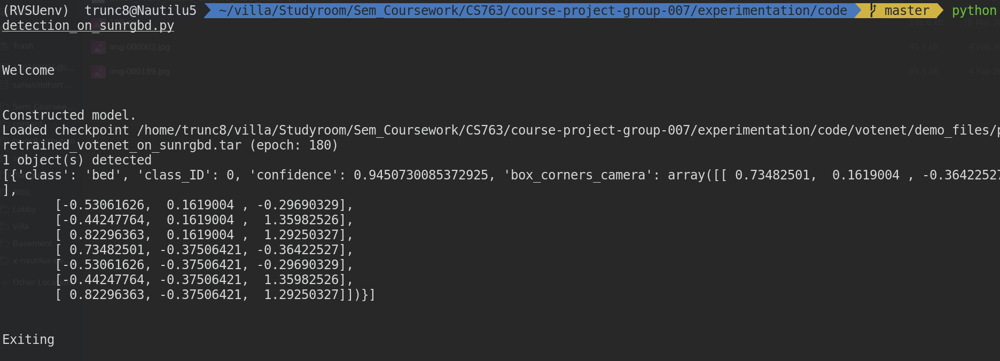

## Installation steps

Please follow the installation steps in [Votenet's repository](https://github.com/facebookresearch/votenet)

## How to Run
`python3 detection_on_sunrgbd.py`  
`python3 detection_on_diode_dataset.py`

## Work done as part of 16 Apr Checkpoint Evaluation
- Understood the Votenet's architecture
- Implemented 3D object detection leveraging Votenet's architecture on images taken from the following dataset:
    - DIODE Dataset (`detection_on_diode_dataset.py`): Converted the RGB image and depth npy file + depth_mask npy file into pointcloud format. The network failed to identify the chairs in the image. A possible reason could be that we're using Votenet weights trained on the SunRGBD dataset. We next switched to the same.
    - SunRGBD dataset (`detection_on_sunrgbd.py`): Converted depth image into pointcloud format and fed it to the Votenet network. On image 3.png, the bed was successfully detected. While on image 189.png, it failed to detect the chairs or table.
    

## Future work
- Improve Votenet's object detection performance on other objects
- Integrate the other two algorithms (Complex YOLO and CubeSLAM) into the 3D object detection pipeline
- Extend the 3D object detection to multiple camera frames mounted on a moving robot to achieve a 3D semantic map
